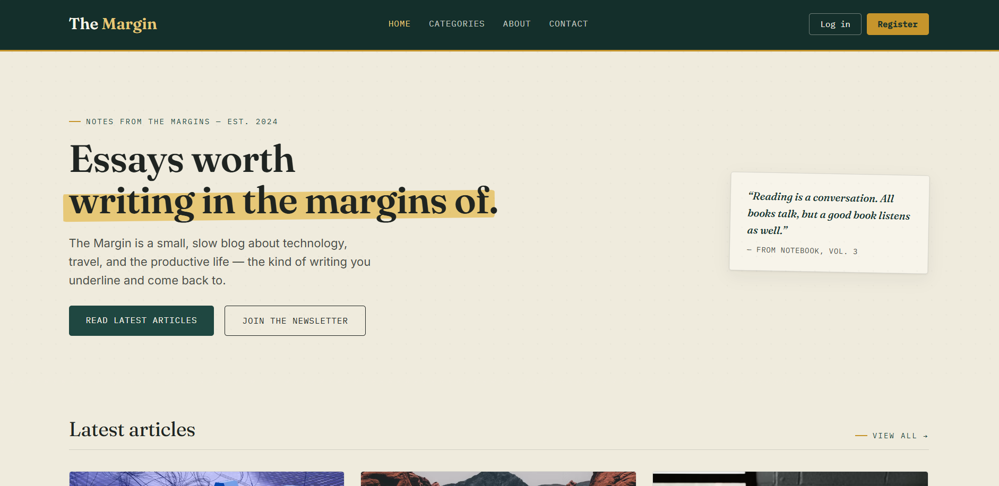

# The Margin — Blog Website with Login and Registration Validation

A responsive, three-page blog website (home, login, register) built with HTML5, CSS3, Bootstrap 5, and vanilla JavaScript form validation. No backend is used — registered accounts are stored in the browser's local storage for demo purposes only.

## Project structure

| File | Description |
|---|---|
| `index.html` | Home page — hero, latest articles, categories, newsletter, footer |
| `login.html` | Login form |
| `register.html` | Registration form |
| `styles.css` | Design system and component styles |
| `login.js` | Login validation + demo authentication |
| `register.js` | Registration validation + demo account creation |
| `images/` | Optional folder for local images |

# My Project

  

## Demo credentials

- Email: `demo@gmail.com`
- Password: `demo123`

## Validation rules

**Registration:** full name (3+ chars), username (4+ chars), valid email, 10-digit phone number, password (8+ chars with upper/lowercase, number, special character), matching confirm password, gender selection, terms acceptance.

**Login:** valid email format, password 8+ characters.

## Running it

Open `index.html` directly in a browser, or serve the folder with VS Code's Live Server extension for the best experience (so relative paths and local storage behave as in a normal site).

## Notes

This is a frontend-only validation exercise. In a production application, every rule enforced here in JavaScript would also need to be enforced again on the server, and passwords would need to be hashed before storage — never kept in local storage or plain text.
